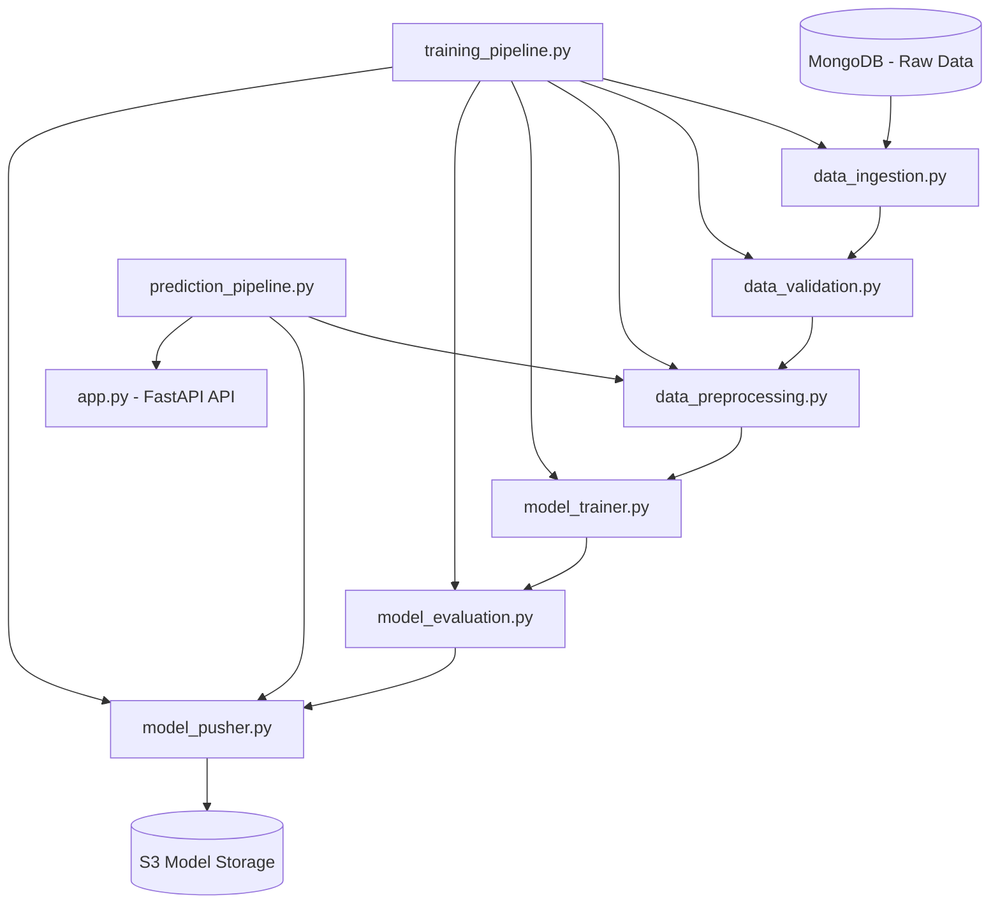

# Vehicle Insurance Interest Prediction System

[](https://www.python.org/) [](https://scikit-learn.org/) [](https://catboost.ai/) [](https://fastapi.tiangolo.com/) [](https://www.docker.com/) [](https://aws.amazon.com/s3/) [](https://www.mongodb.com/) [](https://github.com/features/actions)

A comprehensive end-to-end machine learning system for predicting customer interest in vehicle insurance products. This project demonstrates advanced ML & MLOps practices with CI/CD pipeline, cloud deployment, and production-ready architecture.

---

## Table of Contents

* [Overview](#overview)
* [Dataset](#dataset)
* [Architecture](#architecture)
* [Quickstart](#quickstart)
* [Configuration](#configuration)
* [Docker](#docker)
* [API & Web App](#api--web-app)
* [Model](#model)
* [MLOps Pipeline](#mlops-pipeline)
* [Business Impact](#business-impact)
* [Technology Stack](#technology-stack)
* [Future Enhancements](#future-enhancements)
* [Contributing](#contributing)
* [Contact](#contact)

---

## Overview

This system predicts whether a customer is interested in purchasing vehicle insurance using demographic, policy, and interaction features. It includes: data ingestion from MongoDB, preprocessing and class imbalance handling, CatBoost model training, model artifact versioning in AWS S3, and a FastAPI app (with HTML templates) for real‑time scoring.

**Key Features**

* **End‑to‑end MLOps:** From ingestion to deployment with clear, modular boundaries.
* **Production‑Ready:** Typed, logged, and testable modules with separation of concerns.
* **Cloud Integration:** S3 for model storage, MongoDB for data management.
* **Advanced ML:** SMOTE‑ENN for imbalance, threshold optimization, CatBoost training.
* **Web & API:** FastAPI service with a simple HTML frontend.
* **CI/CD:** Automated test/build/deploy via GitHub Actions.
* **Containerization:** Docker for reproducible environments.

---

## Dataset

* **Records:** 381,109
* **Features:** 12
* **Target:** `Response` (1 = Interested, 0 = Not Interested)
* **Class Distribution:** 87.7% negative, 12.3% positive (highly imbalanced)

**Feature Groups**

* **Demographics:** `Gender`, `Age`, `Driving_License`, `id`
* **Geographic:** `Region_Code`
* **Historical:** `Previously_Insured`, `Vehicle_Age`, `Vehicle_Damage`
* **Financial:** `Annual_Premium`
* **Operational:** `Policy_Sales_Channel`, `Vintage`

---

## Architecture

```text
.
├── src/
│   ├── components/          # ML pipeline blocks
│   │   ├── data_ingestion.py
│   │   ├── data_validation.py
│   │   ├── data_transformation.py
│   │   ├── model_trainer.py
│   │   ├── model_evaluation.py
│   │   └── model_pusher.py
│   ├── pipeline/            # Training & prediction pipelines
│   │   ├── training_pipeline.py
│   │   └── prediction_pipeline.py
│   ├── entity/              # Config & artifact dataclasses
│   ├── cloud_storage/       # AWS S3 helpers
│   ├── configuration/       # Centralized config mgmt
│   ├── constants/           # Project constants
│   ├── exception/           # Custom exceptions
│   ├── logger/              # Structured logging
│   └── utils/               # Shared utilities
├── config/                  # YAML & env configs
├── notebook/                # EDA notebooks
├── templates/               # Jinja2 templates
├── static/                  # CSS/JS assets
├── .github/workflows/       # CI/CD pipelines
├── app.py                   # FastAPI entrypoint
├── Dockerfile               # Container image
└── requirements.txt         # Dependencies
```

**High‑Level Flow (Mermaid)**



---

## Quickstart

### 1) Clone & Setup

```bash
git clone https://github.com/rohitkr8527/vehicle-insurance-churn.git
cd vehicle-insurance-churn
python -m venv venv
# Linux/macOS
source venv/bin/activate
# Windows (PowerShell)
venv\Scripts\Activate.ps1
pip install -r requirements.txt
```

### 2) Environment Variables

Create a `.env` file:

```bash
MONGODB_URL=your_mongodb_connection_string
AWS_ACCESS_KEY_ID=your_aws_access_key
AWS_SECRET_ACCESS_KEY=your_aws_secret_key
AWS_DEFAULT_REGION=ap-south-1
S3_BUCKET=your_s3_bucket_name
```

### 3) Run Locally

```bash
python app.py
```

App will start on **[http://localhost:5000](http://localhost:5000)** (as configured in `app.py`).

---

## Docker

**Build**

```bash
docker build -t autoinsure-interest-predictor .
```

**Run**

```bash
docker run -p 5000:5000 --env-file .env autoinsure-interest-predictor
```

---

## API & Web App

### Web UI

1. Open **[http://localhost:5000](http://localhost:5000)**.
2. Fill the form with customer details.
3. Click **Predict** to see probability and binary decision.

### REST API

**Health Check**

```http
GET /
```

**Predict (form-encoded)**

```http
POST /
Content-Type: application/x-www-form-urlencoded

gender=1&age=35&driving_license=1&region_code=28&previously_insured=0&annual_premium=30000&policy_sales_channel=152&vintage=100&vehicle_age_lt_1_year=0&vehicle_age_gt_2_years=1&vehicle_damage_yes=1
```

**Predict (JSON)**

```http
POST /predict
Content-Type: application/json

{
  "Gender": 1,
  "Age": 35,
  "Driving_License": 1,
  "Region_Code": 28.0,
  "Previously_Insured": 0,
  "Annual_Premium": 30000,
  "Policy_Sales_Channel": 152.0,
  "Vintage": 100,
  "Vehicle_Age_lt_1_Year": 0,
  "Vehicle_Age_gt_2_Years": 1,
  "Vehicle_Damage_Yes": 1
}
```

**Python Usage**

```python
from src.pipeline.prediction_pipeline import VehicleData, VehicleDataClassifier

vehicle_data = VehicleData(
    Gender=1, Age=35, Driving_License=1, Region_Code=28.0,
    Previously_Insured=0, Annual_Premium=30000, Policy_Sales_Channel=152.0,
    Vintage=100, Vehicle_Age_lt_1_Year=0, Vehicle_Age_gt_2_Years=1,
    Vehicle_Damage_Yes=1
)

classifier = VehicleDataClassifier()
df = vehicle_data.get_vehicle_input_data_frame()
pred = classifier.predict(df)
print(pred)  # 1 = Interested, 0 = Not Interested
```

---

## Model

**Final Model:** CatBoostClassifier

| Metric            | Value |
| ----------------- | ----: |
| ROC‑AUC           | 0.854 |
| Precision         | 0.306 |
| Recall            | 0.844 |
| F1‑Score          | 0.449 |
| Optimal Threshold |  0.65 |

**Configuration**

* **Algorithm:** CatBoost with class weighting
* **Hyperparameters:** `iterations=400`, `depth=8`, `learning_rate=0.1`
* **Imbalance Handling:** SMOTE‑ENN on training folds
* **Validation:** Stratified 5‑fold CV
* **Thresholding:** Operating point selected to balance business precision/recall

**Why CatBoost?**

* Handles categorical features efficiently
* Strong performance on tabular data
* Built‑in regularization and fast training

---

## MLOps Pipeline

### Training

1. **Data Ingestion:** Pulls data from MongoDB collections.
2. **Validation:** Schema checks, missing/invalid detection, basic drift signals.
3. **Transformation:** Encoding, scaling, feature engineering, and train/val split.
4. **Resampling:** SMOTE‑ENN applied on the training split only.
5. **Training:** CatBoost model training with tuned hyperparameters.
6. **Evaluation:** CV metrics, ROC/PR curves, confusion matrix.
7. **Model Push:** Uploads artifacts to AWS S3 if performance exceeds baseline.

### Prediction

1. **Preprocessing:** Same transformers applied to request payload.
2. **Model Loading:** Latest approved artifact pulled from S3.
3. **Scoring:** Probability estimates + thresholding to binary response.

---

## Business Impact

* **Customer Acquisition Cost:** Lower via focused outreach to high‑probability leads.
* **Marketing Efficiency:** High recall (≈84%) minimizes missed opportunities.
* **Resource Allocation:** Prioritize sales follow‑ups where conversion likelihood is highest.

**Use Cases**

* Campaign targeting, lead scoring, segmentation, and product feedback loops.

---

## Technology Stack

* **ML:** CatBoost, scikit‑learn, imbalanced‑learn, NumPy, Pandas
* **Serving:** FastAPI, Jinja2
* **Visualization:** Matplotlib, Plotly
* **Storage:** AWS S3 (artifacts), MongoDB (source data)
* **DevOps:** Docker, GitHub Actions
* **Config & Logging:** YAML configs, Python logging with custom handlers

---

## Future Enhancements

**Technical**

* SHAP for interpretability
* Real‑time monitoring and alerts
* A/B testing framework
* Ensemble candidates and stacking

**Business**

* CLV prediction
* Churn‑risk integration
* Dynamic pricing recommendations
* Campaign ROI tracking
* Compliance & audit reporting

**Infrastructure**

* Kubernetes for horizontal scaling
* Stream processing for near real‑time scoring
* Airflow for scheduled training and data pipelines
* Multi‑cloud strategy

---

## Contributing

1. Fork the repo and create a feature branch.
2. Use conventional commits.
3. Add/extend tests where applicable.
4. Submit a PR with a clear description and context.

---

## Contact

* **GitHub:** `rohitkr8527`
* **LinkedIn:** `https://www.linkedin.com/in/rohitkmr8527/`
* **Email:** `rohitkr8527@gmail.com`

> ⭐ Star this repository if you found it helpful! Contributions and feedback are always welcome.
